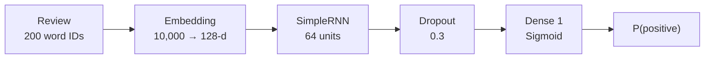
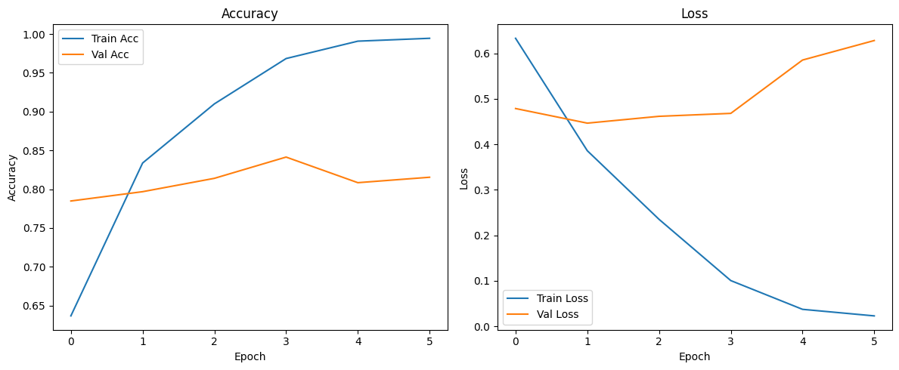

# 🎬 IMDB Sentiment Analysis with RNNs

[](https://colab.research.google.com/github/MMujtabaX/RNN/blob/main/DL_S05E01_Seq_Models_IMDB_Shared.ipynb)


Classifying movie reviews as **positive or negative** with a **Recurrent Neural Network**. The notebook covers the full NLP workflow for sequence models: encoding text as integer sequences, decoding it back to words, padding, learning word embeddings, training a recurrent layer, and predicting the sentiment of brand-new reviews.

## 📌 The Dataset

The **IMDB Movie Reviews** dataset from Keras: **50,000 reviews** (25,000 train and 25,000 test), balanced between positive and negative.

| Setting | Value | Why |
|---------|-------|-----|
| Vocabulary | Top **10,000** words | Rare words become `<UNK>`, keeping the embedding table manageable |
| Sequence length | **200** words | Short reviews are zero-padded; long ones are truncated |

Reviews arrive as integer sequences. The notebook builds a **reverse word index** to decode them back into readable text:

```
Encoded : [1, 14, 22, 16, 43, 530, 973, ...]
Decoded : <START> this film was just brilliant casting location scenery story ...
Label   : 1 (positive)
```

## 🧱 Model Architecture



```python
model_rnn = Sequential([
    Input(shape=(200,)),
    Embedding(input_dim=10000, output_dim=128),
    SimpleRNN(64),
    Dropout(0.3),
    Dense(1, activation='sigmoid')
])
```

**1.29M parameters.** Almost all of them (1.28M) are in the embedding layer, which learns a 128-dimensional vector for each word.

## 🏋️ Training

Adam optimizer, binary cross-entropy, batch size 128, 20% validation split, and **early stopping** (patience 4, restoring the best weights).

<p align="center">
  
</p>

The model **overfits quickly**. Training accuracy climbs past 99% while validation loss starts rising after **epoch 2**. Early stopping halted training at epoch 6 and restored the epoch-2 weights, the point of best generalization.

## 📊 Results

| Metric | Score |
|--------|-------|
| **Test Accuracy** | **80.5%** |
| Test Loss | 0.429 |

Evaluated on the full 25,000-review test set.

### Predictions on new reviews

| Review | Prediction | P(positive) |
|--------|------------|-------------|
| "What a waste of time. The plot made no sense, the acting was terrible..." | 😞 Negative | 0.04 |
| "A decent film with some great moments. Not perfect, but worth watching once." | 😊 Positive | 0.74 |
| "I fell asleep halfway through. Boring characters and a predictable storyline." | 😞 Negative | 0.05 |

The model is confident on clearly negative reviews and less certain on the mixed "decent but not perfect" review, which is a sensible behavior.

## 💡 Key Takeaways

- **Text must become numbers:** word → integer ID → learned dense embedding.
- **Padding** gives every sequence the same length so reviews can be batched.
- **SimpleRNN struggles with long sequences** because of vanishing gradients, so information from early in a 200-word review fades by the end.
- **Embeddings overfit easily:** with 1.28M embedding weights and 20K training reviews, early stopping is essential.

## 🔮 Next Steps

- **LSTM and GRU:** gated recurrent units that keep long-range context and usually beat SimpleRNN on IMDB
- **Bidirectional RNNs:** read the review in both directions
- **Attention:** let the model focus on the most sentiment-heavy words
- **Pretrained embeddings** (GloVe) or **Transformers** (DistilBERT)

## 🚀 Run It

Click the **Open in Colab** badge above, or run it locally:

```bash
pip install tensorflow matplotlib jupyter
jupyter notebook DL_S05E01_Seq_Models_IMDB_Shared.ipynb
```

The IMDB dataset downloads automatically through Keras.

## 👤 Author

**Muhammad Mujtaba Khan Suri** — CS @ UBIT, University of Karachi
[GitHub](https://github.com/MMujtabaX)
